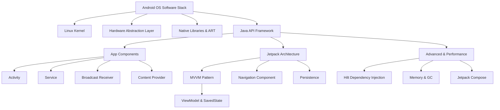

# 🚀 Android Interview & Architecture Master Hub

Welcome to the **Android Interview & Architecture Master Hub**. This open-source repository is a comprehensive, production-aligned study system designed to help developers master Android OS internals, Jetpack components, multi-threaded programming, and pass senior-level Android technical interviews.

---

## 🗺️ Learning Progression & Dependency Graph

Follow this recommended path to master topics sequentially, building from core OS layers to modern declarative frameworks:

---

## 📁 Table of Contents

### 📚 Part 1: Core Foundations
* [Chapter 1: Android Architecture & Core Components](Study_Guide/Part_01_Foundations.md#chapter-1-android-architecture--components-overview)
* [Chapter 2: Application Class & Context Decoupling](Study_Guide/Part_01_Foundations.md#chapter-2-application-class--context)
* [Chapter 3: Activity Lifecycle & Callbacks](Study_Guide/Part_01_Foundations.md#chapter-3-activity-lifecycle)
* [Chapter 4: Activity Launch Modes & Tasks](Study_Guide/Part_01_Foundations.md#chapter-4-activity-launch-modes--back-stack)
* [Chapter 5: Fragments View vs. Instance Lifecycles](Study_Guide/Part_01_Foundations.md#chapter-5-fragments)

### 📡 Part 2: Async & Communications
* [Chapter 6: Intents, Intent Filters & Security](Study_Guide/Part_02_Intents_Threading.md#chapter-6-intents--intent-filters)
* [Chapter 7: Threading Internals (Looper, Handler, Coroutines)](Study_Guide/Part_02_Intents_Threading.md#chapter-7-threading-ui-thread-looper-handler-handlerthread-asynctask-coroutines)
* [Chapter 8: Services & Process Lifecycles](Study_Guide/Part_02_Intents_Threading.md#chapter-8-services--process-lifecycle)

### 🔒 Part 3: Data Sharing & Security
* [Chapter 9: Broadcast Receivers (Static vs. Dynamic)](Study_Guide/Part_03_Broadcast_ContentProvider_Permissions.md#chapter-9-broadcast-receivers)
* [Chapter 10: Content Providers & FileProviders](Study_Guide/Part_03_Broadcast_ContentProvider_Permissions.md#chapter-10-content-providers--contentresolver)
* [Chapter 11: Modern Runtime Permissions (API 23–35)](Study_Guide/Part_03_Broadcast_ContentProvider_Permissions.md#chapter-11-runtime-permissions)

### 🏛️ Part 4: Jetpack Architecture & Persistence
* [Chapter 12: Unidirectional MVVM Patterns](Study_Guide/Part_04_Architecture.md#chapter-12-mvvm-architecture)
* [Chapter 13: ViewModel Configuration Survival](Study_Guide/Part_04_Architecture.md#chapter-13-viewmodel)
* [Chapter 14: SavedStateHandle & Process Death Survival](Study_Guide/Part_04_Architecture.md#chapter-14-savedstatehandle--process-death)
* [Chapter 15: Jetpack Navigation graphs & Back Stacks](Study_Guide/Part_04_Architecture.md#chapter-15-navigation-component)
* [Chapter 16: Core Persistence (DataStore, Room ORM)](Study_Guide/Part_04_Architecture.md#chapter-16-data-persistence-sharedpreferences-datastore-files-sqlite-room)

### ⚡ Part 5: Memory Profile & Performance Optimization
* [Chapter 17: Memory Leak Patterns & ART Generational GC](Study_Guide/Part_05_Memory_Performance_Advanced.md#chapter-17-memory-leaks--garbage-collection)
* [Chapter 18: ANR Profiling, StrictMode & Overdraw](Study_Guide/Part_05_Memory_Performance_Advanced.md#chapter-18-anr-performance--best-practices)
* [Chapter 19: Dependency Injection (Dagger Hilt Modules)](Study_Guide/Part_05_Memory_Performance_Advanced.md#chapter-19-dependency-injection-with-hilt)
* [Chapter 20: Jetpack Compose Recompositions vs. XML Views](Study_Guide/Part_05_Memory_Performance_Advanced.md#chapter-20-jetpack-compose-modern-ui-vs-xml-views)

---

## 🛠️ High-Yield Study Assets

* 🎯 **[Interview Q&A Cheat Sheet](Reference/Interview_Cheat_Sheet.md):** 50+ deep senior-level architectural Q&As.
* 📊 **[Quick Revision Tables](Reference/Quick_Revision_Sheet.md):** Rapid reference matrices comparing launch modes, lifecycles, and storage options.
* 🏁 **[7-Day & 1-Day Study Plans](Reference/Study_Plans_And_Graphs.md):** High-intensity roadmap revision plans.
* 🏦 **[Interview Question Bank](Interview_Questions/Interview_Question_Bank.md):**
  * 300 Core Android Interview Questions
  * 100 Real-world Scenario Challenges
  * 50 Debugging cases with code snippets (Faulty vs. Fixed Kotlin)

---

## ⚖️ Context Comparison Cheat Sheet

| Feature / Property | Application Context | Activity Context | Service Context |
| :--- | :--- | :--- | :--- |
| **Lifespan** | Process Lifetime | Activity Lifetime | Service Lifetime |
| **Theme-Aware?** | ❌ No | ✅ Yes | ❌ No |
| **Safe for Singletons?** | ✅ Yes | ❌ No (Leaks context) | ❌ No |
| **Can Inflate Layouts?** | ❌ Not recommended | ✅ Yes | ❌ No |
| **Can Show Dialogs?** | ❌ No (BadTokenException) | ✅ Yes | ❌ No |

---

## 🤝 Contributing

Contributions are welcome! If you notice an issue, want to add modern API references (Android 15), or submit new debugging scenarios:
1. Fork the project.
2. Create your feature branch (`git checkout -b feature/AmazingFeature`).
3. Commit your changes (`git commit -m 'Add some AmazingFeature'`).
4. Push to the branch (`git push origin feature/AmazingFeature`).
5. Open a Pull Request.

---

## 📜 License

Distributed under the MIT License. See `LICENSE` for more information.
