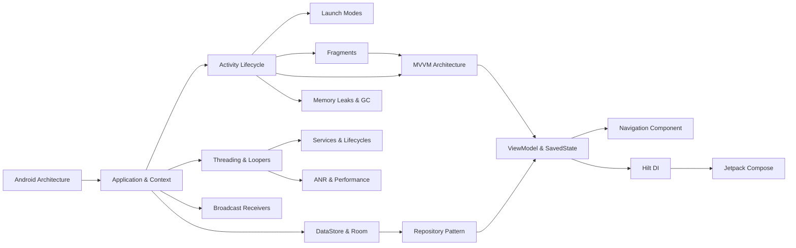

# 🚀 Android Developer Knowledge Hub

[](https://kotlinlang.org)
[](https://developer.android.com)
[](#contributing)
[](https://github.com/aravind-p-developer/Android-Developer-Knowledge-Hub)

Welcome to the **Android Developer Knowledge Hub**! This repository is designed to be a long-term, comprehensive open-source Android learning platform mapping a developer's journey from absolute fundamentals to advanced, production-grade Android engineering.

---

## 📌 Current Status

* **Current Completion:** ✅ **Phase 1: Android Fundamentals**
* **Next Module:** 🔄 **Phase 2: Kotlin Fundamentals & OOP**

> [!NOTE]
> **Follow The Journey:**
> This repository is being built publicly while progressing from Android Fundamentals to Advanced Android Development. It will evolve organically into a complete portfolio-quality knowledge platform. 

---

## 🗺️ Long-Term Learning Roadmap (10 Phases)

The platform is structured into ten progressive phases to build authority and deep technical competence systematically:

```
+-----------------------------------------------------------------------------------+
|                            ROADMAP PROGRESS TRACKER                               |
+-----------------------------------------------------------------------------------+
|  [Phase 1] Android Fundamentals (COMPLETE ✅)                                     |
|  [Phase 2] Kotlin Fundamentals & SOLID (UPCOMING 🔄)                               |
|  [Phase 3] Coroutines & Flows (UPCOMING 🔄)                                       |
|  [Phase 4] Architecture & Repository Patterns (UPCOMING 🔄)                       |
|  [Phase 5] Network & API Integration (UPCOMING 🔄)                                |
|  [Phase 6] Offline Cache & Room (UPCOMING 🔄)                                      |
|  [Phase 7] Dependency Injection with Hilt (UPCOMING 🔄)                           |
|  [Phase 8] Background Tasks & WorkManager (UPCOMING 🔄)                           |
|  [Phase 9] Jetpack Compose & State (UPCOMING 🔄)                                  |
|  [Phase 10] Unit, Integration & UI Testing (UPCOMING 🔄)                          |
+-----------------------------------------------------------------------------------+
```

### 📈 Phase Details
* **Phase 1: Android Fundamentals (Complete ✅):** Architecture, Context, Component Lifecycles, Launch Modes, Tasks, Fragments, Intents, Broadcasts, Content Providers, Runtime Permissions, ViewModels, Threads, and Memory Leaks.
* **Phase 2: Kotlin Fundamentals (Upcoming 🔄):** Syntax basics, Object-Oriented Programming (OOP) in Kotlin, Collections API, Generics, and SOLID principles.
* **Phase 3: Coroutines & Flows (Upcoming 🔄):** Suspend mechanisms, Dispatchers, structured concurrency, cold/hot flows, StateFlow, and SharedFlow.
* **Phase 4: Architecture Deep Dive (Upcoming 🔄):** Clean Architecture, Repository Patterns, Use Cases, and advanced MVVM structures.
* **Phase 5: Network & API Design (Upcoming 🔄):** Retrofit client setup, OkHttp configurations, caching, API security, and JSON parsing.
* **Phase 6: Offline Cache & Room (Upcoming 🔄):** Database transactions, DAOs, reactive queries, migration paths, and offline-first data architectures.
* **Phase 7: Dependency Injection (Upcoming 🔄):** Hilt compiler configurations, component lifetimes, module provides vs binds, and scoping.
* **Phase 8: Background Tasks (Upcoming 🔄):** WorkManager worker schedulers, constraints, periodic requests, and foreground service handlers.
* **Phase 9: Jetpack Compose (Upcoming 🔄):** Declarative UIs, modifiers, recomposition optimization, Compose navigation, and state hosting.
* **Phase 10: Testing (Upcoming 🔄):** JUnit test runners, Mockito frameworks, ViewModel tests, repository verification, and UI layout checks.

---

## 📈 Topic Dependency Graph

Follow this recommended path to master topics sequentially:



---

## 🛠️ High-Yield Study Assets (Phase 1: Fundamentals)

* 📚 **[Complete Fundamentals Guide](Study_Guide/):** Highly detailed chapters covering all basic components.
* 🎯 **[Interview Q&A Cheat Sheet](Reference/Interview_Cheat_Sheet.md):** 50+ deep senior-level architectural Q&As.
* 📊 **[Quick Revision Tables](Reference/Quick_Revision_Sheet.md):** Rapid reference matrices comparing launch modes, lifecycles, and storage options.
* 🏁 **[7-Day & 1-Day Study Plans](Reference/Study_Plans_And_Graphs.md):** High-intensity roadmap revision plans.
* 🏦 **[Interview Question Bank](Interview_Questions/Interview_Question_Bank.md):**
  * 300 Core Android Interview Questions
  * 100 Real-world Scenario Challenges
  * 50 Debugging cases with code snippets (Faulty vs. Fixed Kotlin)

---

## 🤝 Contributing

Contributions are welcome! If you notice an issue, want to add modern API references (Android 15), or submit new debugging scenarios:
1. Fork the project.
2. Create your feature branch (`git checkout -b feature/AmazingFeature`).
3. Commit your changes (`git commit -m 'Add some AmazingFeature'`).
4. Push to the branch (`git push origin feature/AmazingFeature`).
5. Open a Pull Request.

---

## 📜 License

Distributed under the MIT License. See `LICENSE` for more information.
