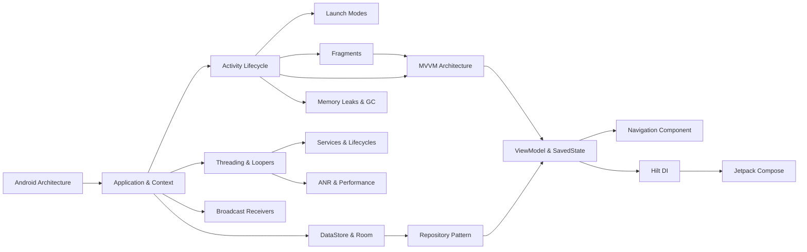

# Study Plans, Mind Map & Dependency Graph

---

## 📅 7-Day Revision Plan

This plan is structured for developers who have already read the guide and need a structured, high-intensity review before an interview.

```
+---------------------------------------------------------------------------------+
|                                 7-DAY ROADMAP                                   |
+---------------------------------------------------------------------------------+
|  Day 1: Foundations (Ch 1-5)  |  Day 2: Async & Background (Ch 6-8)             |
|  Day 3: Security & Data (Ch 9-11)|  Day 4: Architecture (Ch 12-14)                 |
|  Day 5: Nav & Persistence (Ch 15-16) | Day 6: Memory & Perf (Ch 17-18)            |
|  Day 7: DI, Compose & Mocks (Ch 19-20)                                          |
+---------------------------------------------------------------------------------+
```

### Day 1: Foundations (Chapters 1–5)
* **Focus:** Architecture Overview, Application Class, Context, Activity Lifecycle, Launch Modes, Fragments.
* **Revision Strategy:**
  1. Review the Zygote boot sequence and process lifecycle hierarchy.
  2. Study the Context Theme Wrapper decorator structure.
  3. Draw the Activity lifecycle callback flows, configuration change transitions, and back stack behaviors.
  4. Review fragment-to-fragment communication using the Fragment Result API.
* **Practice Exercises:**
  * Implement a Custom Application class with App Startup.
  * Write a Fragment that handles ViewBinding safely without memory leaks.

### Day 2: Async & Background Service (Chapters 6–8)
* **Focus:** Intents, Threading, Services, and Process Lifecycles.
* **Revision Strategy:**
  1. Review explicit vs implicit intents and intent security.
  2. Study `ActivityThread.main()`, `Looper`, `Handler`, and `MessageQueue` dynamics.
  3. Master started vs bound services, local binding (IBinder), and remote binding (Messenger/AIDL).
  4. Memorize the Foreground Service 5-second notification rules.
* **Practice Exercises:**
  * Write a Custom `HandlerThread` that processes background callbacks.
  * Implement a Bound Service communicating with an Activity via Messenger.

### Day 3: Security & Data Sharing (Chapters 9–11)
* **Focus:** Broadcast Receivers, Content Providers, and Runtime Permissions.
* **Revision Strategy:**
  1. Master static vs dynamic Broadcast Receivers and background limitations (API 26+).
  2. Review Content Provider binder thread pools and `FileProvider` layouts.
  3. Study runtime permission request cycles and Android 33+ granular permissions.
* **Practice Exercises:**
  * Implement an ordered Broadcast Receiver with result code modification.
  * Create a secure `FileProvider` share intent for an image.

### Day 4: Architecture & Lifecycle-Aware States (Chapters 12–14)
* **Focus:** MVVM, ViewModel, SavedStateHandle, and Process Death.
* **Revision Strategy:**
  1. Study Unidirectional Data Flow (UDF) and LiveData vs StateFlow properties.
  2. Review how `NonConfigurationInstances` preserves `ViewModelStore` on rotation.
  3. Study the serialization limits of `SavedStateHandle` and process death restoration.
* **Practice Exercises:**
  * Build a ViewModel exposing `StateFlow` and observing it with `repeatOnLifecycle`.
  * Write state restoration code using `SavedStateHandle`.

### Day 5: Navigation & Core Persistence (Chapters 15–16)
* **Focus:** Jetpack Navigation, DataStore, and Room ORM.
* **Revision Strategy:**
  1. Study `NavBackStackEntry` scopes and multiple back stack handling.
  2. Contrast SharedPreferences sync locks with DataStore flow structures.
  3. Review SQLite Cursor bindings, Room compile-time verifications, and schemas.
* **Practice Exercises:**
  * Write a DataStore preferences manager with flow operations.
  * Implement Room migrations with transactional updates.

### Day 6: Memory Profiling & Performance (Chapters 17–18)
* **Focus:** Memory Leaks, Garbage Collection, ANRs, and Profile Tools.
* **Revision Strategy:**
  1. Memorize the 12 primary causes of memory leaks.
  2. Review ART generational GC phases and `onTrimMemory` levels.
  3. Study the 3 primary ANR triggers (input, broadcast, service) and StrictMode rules.
* **Practice Exercises:**
  * Configure `StrictMode` in a debug application.
  * Analyze a memory dump containing a static Activity reference.

### Day 7: DI, Modern UI & Mock Interview (Chapters 19–20)
* **Focus:** Dependency Injection with Hilt, Jetpack Compose, and Mock Review.
* **Revision Strategy:**
  1. Study Hilt code-generation, component scopes, and custom modules (@Provides vs @Binds).
  2. Review Compose recomposition trees, state holders (`remember`, `mutableStateOf`), and side-effects.
  3. Conduct a full review using the `Interview_Cheat_Sheet.md`.
* **Practice Exercises:**
  * Build a Compose layout using `Scaffold` and `LazyColumn`.
  * Bind ViewModel dependencies using Hilt construction injection.

---

## ⚡ One-Day Interview Crash Course

A high-yield, 10-hour study plan designed for the day before an interview.

```
08:00 - 09:30 | Core Foundations (Application, Context, Activity, LaunchModes)
09:30 - 11:00 | Async & Background Tasks (Looper, Handler, Services, WorkManager)
11:00 - 12:30 | Security & Data Sharing (Broadcasts, Content Providers, Permissions)
12:30 - 13:30 | LUNCH BREAK (Review Key Terms)
13:30 - 15:00 | Architecture (MVVM, ViewModel, StateFlow, SavedStateHandle)
15:00 - 16:30 | Memory, Performance & Profiling (Leaks, GC, ANR, Profiler)
16:30 - 18:00 | Modern UI & Dependency Injection (Compose, Hilt)
```

### Hour 1–1.5: Core Foundations (08:00 - 09:30)
* **Key Tasks:** Read Ch 1–5 in `Part_01_Foundations.md`.
* **High-Yield Concepts:**
  * Activity lifecycle transitions: A.onPause() $\rightarrow$ B.onCreate() $\rightarrow$ B.onStart() $\rightarrow$ B.onResume() $\rightarrow$ A.onStop().
  * Launch modes: difference between `singleTask` (clears top) and `singleInstance` (isolated task).
  * Fragments: View lifecycle (`onDestroyView`) vs. Instance lifecycle (`onDestroy`).

### Hour 1.5–3: Async & Background Tasks (09:30 - 11:00)
* **Key Tasks:** Read Ch 6–8 in `Part_02_Intents_Threading.md`.
* **High-Yield Concepts:**
  * `Looper` keeps thread alive via infinite loop; `Handler` posts `Runnable` messages to `MessageQueue`.
  * Services run on the Main Thread by default.
  * Foreground Service 5-second rule: `startForeground()` must be called within 5 seconds of `startForegroundService()`.

### Hour 3–4.5: Security & Data Sharing (11:00 - 12:30)
* **Key Tasks:** Read Ch 9–11 in `Part_03_Broadcast_ContentProvider_Permissions.md`.
* **High-Yield Concepts:**
  * Broadcast Receivers: Dynamic receivers are not restricted by API 26 background execution limits.
  * Content Providers run on Binder threads, not the main thread.
  * Granular storage permissions in Android 13+ (images, video, audio instead of global read).

### Hour 4.5–5.5: Lunch Break & Terminology Review (12:30 - 13:30)
* Quick flashcard review: OOM adjust scores, Zygote, HAL, Binder transaction limit (1MB).

### Hour 5.5–7: Architecture & Jetpack (13:30 - 15:00)
* **Key Tasks:** Read Ch 12–14 in `Part_04_Architecture.md`.
* **High-Yield Concepts:**
  * `ViewModelStore` survives configuration changes by being retained inside `NonConfigurationInstances`.
  * `SavedStateHandle` stores data in system-level bundles to survive process death.
  * Room compilation checks entity integrity at compile time.

### Hour 7–8.5: Memory & Performance (15:00 - 16:30)
* **Key Tasks:** Read Ch 17–18 in `Part_05_Memory_Performance_Advanced.md`.
* **High-Yield Concepts:**
  * Static references, non-static inner classes, and anonymous handlers leak Activity instances.
  * ANR triggers: Input dispatcher (5s), Broadcast receiver (10s), Service (20s).
  * StrictMode detects disk/network accesses on the main thread in debug builds.

### Hour 8.5–10: Modern Stack & DI (16:30 - 18:00)
* **Key Tasks:** Read Ch 19–20 in `Part_05_Memory_Performance_Advanced.md`.
* **High-Yield Concepts:**
  * Hilt scopes (@Singleton, @ActivityScoped) tie dependency lifecycles to their components.
  * Compose side effects: `LaunchedEffect` (run suspend code on key changes), `DisposableEffect` (cleanup on leave).

---

## 🗺️ Mind Map of All Concepts

The following diagram maps the core relationships and components within the Android OS.

```mermaid
graph TD
    %% Base OS Nodes
    OS[Android OS Software Stack] --> Linux[Linux Kernel]
    OS --> HAL[Hardware Abstraction Layer]
    OS --> Native[Native Libraries & ART]
    OS --> Framework[Java API Framework]

    %% Components
    Framework --> Comp[App Components]
    Comp --> Act[Activity]
    Comp --> Serv[Service]
    Comp --> BR[Broadcast Receiver]
    Comp --> CP[Content Provider]

    %% Activities
    Act --> ActLife[Lifecycle]
    ActLife --> OC[onCreate]
    ActLife --> OSrt[onStart]
    ActLife --> OR[onResume]
    ActLife --> OP[onPause]
    ActLife --> OSt[onStop]
    ActLife --> OD[onDestroy]
    Act --> LM[Launch Modes]
    LM --> Std[standard]
    LM --> ST[singleTop]
    LM --> S_Task[singleTask]
    LM --> S_Inst[singleInstance]
    Act --> Frag[Fragments]
    Frag --> F_Life[View Lifecycle]

    %% Services
    Serv --> ServType[Service Types]
    ServType --> Started[Started Service]
    ServType --> Bound[Bound Service]
    ServType --> FG[Foreground Service]

    %% Broadcasts
    BR --> RegType[Registration]
    RegType --> Static[Static Manifest]
    RegType --> Dynamic[Dynamic Code]

    %% Content Providers
    CP --> CR[ContentResolver]
    CP --> FP[FileProvider]

    %% Architecture
    Framework --> Arch[Jetpack Architecture]
    Arch --> MVVM[MVVM Pattern]
    MVVM --> View[View]
    MVVM --> VM[ViewModel]
    MVVM --> Repo[Repository]
    VM --> SSH[SavedStateHandle]
    VM --> SF[StateFlow]
    Arch --> Nav[Navigation Component]
    Arch --> Pers[Persistence]
    Pers --> Room[Room Database]
    Pers --> DS[DataStore]

    %% Advanced
    Framework --> Adv[Advanced & Performance]
    Adv --> DI[Hilt Dependency Injection]
    Adv --> Mem[Memory & GC]
    Mem --> Leaks[Memory Leaks]
    Leaks --> LeakCanary[LeakCanary]
    Adv --> Perf[Performance]
    Perf --> ANR[ANR Triggers]
    Perf --> SM[StrictMode]
    Adv --> UI[Jetpack Compose]
```



---

## 📈 Topic Dependency Graph

This graph represents the recommended progression path when learning or revising Android topics. Solid links indicate direct prerequisites.


